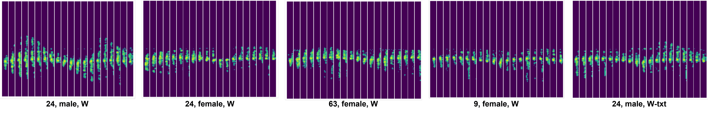

# RDGait

Dataset for paper "RDGait: A mmWave Gait-based User Recognition System for Complex Indoor Environments Using Single-chip Radar"

We conducted a comprehensive evaluation of RDGait through laboratory studies with volunteers.
A total of 125 volunteers were invited to generate the gait dataset,
including 66 males and 59 females, with ages ranging from 6 to 63 years.
The average age of volunteers is 28.6 years, with a standard deviation of 13.06 years.
We established two sessions for the dataset, namely the Crowded-Office session and the Spacious-Corridor session.

*Session I: Crowded-Office*

*Session II: Spacious-Corridor*

Volunteers were instructed to walk back and forth within the designated area, first walking towards the radar and then walking away. In the experiment, we only specified the walking direction for volunteers and did not require volunteers to follow a predefined trajectory.
In each session, volunteers went through five distinct walking behaviors: normal walking (W), walking with a backpack (W-BP), walking with a handbag (W-HB), walking while calling (W-Call), and walking while texting (W-txt). In particular, the fifth behavior, W-txt was excluded for seniors and children due to behavioral habits. Each volunteer performed these behaviors in both scenarios for 2 minutes, contributing to a total data collection period of 20 minutes per volunteer. The collective data from all volunteers amounted to 2500 minutes (approximately 42 hours).

We preprocess each frame's range-Doppler heatmap using the proposed method in RDGait, segmenting them into samples. Each sample consists of 1 second (20 frames) of radar data. To compare with other gait recognition methods, besides RDStack, we also preprocess the data into three other formats.
The first format is the micro-Doppler spectrogram (MD for short), which is derived by summing RDStacks along the range dimension, resulting in samples sized at $20\times255$. The second format, the range-time spectrogram (RT for short), comprises samples sized at $20\times70$. Finally, the last format is the point cloud (PC for short), where each frame is sized at $N\times4\times20$, with $N$ representing the number of extracted points. Each point has four attributes: $(x, y, v, snr)$, where $x = r\cdot cos\theta$, $y = r\cdot sin\theta$, $r$ is a range, $snr$ is signal-to-noise ratio, and $\theta$ is the angle of the point, estimated by Minimum Variance Distortionless Response (MVDR) beamforming.

*RDStack samples, we list age, gender, and walking behavior separately under each subfigure.*

Dataset Download:

[RDStack](https://rec.ustc.edu.cn/share/38b54aa0-48c7-11ef-a4af-ebe579c31b6b)

[micro-Doppler](https://rec.ustc.edu.cn/share/69563350-48c7-11ef-b4de-813663f36059)

[micro-Range](https://rec.ustc.edu.cn/share/80dc2be0-48c7-11ef-96d6-a1208be7d909)

[pointcloud](https://rec.ustc.edu.cn/share/9e9d96b0-48c7-11ef-8dc1-7bed7a19e68d)

File naming rules: 

**i**_s**j**_a**k**.h5

**i**: User index 1,2,...,125

**j**: Scnen index 1:Crowded-Office 2:Spacious-Corridor

**k**: Action index 1:W 2:W-BP 3:W-HB 4:W-Call 5:W-txt 

